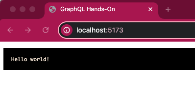

# GraphQL Hands-On

- https://graphql.org/

## Backend

- https://expressjs.com/
- [README.md](backend/README.md)

## Frontend

- https://vitejs.dev/
- [README.md](frontend/README.md)

## How to set up

```bash
npm run install
npm run dev
```



### npm install

```bash
# all
npm install xxx

# backend
npm install xxx -w backend

# frontend
npm install xxx -w frontend
```

## How to GraphQL

### Backend
1. Backend 側に Schema を定義
2. Schema に対応した処理を作成
3. 作成した関数を handler に登録

### Frontend
1. Query を作成
2. Request body に query と variables を指定
